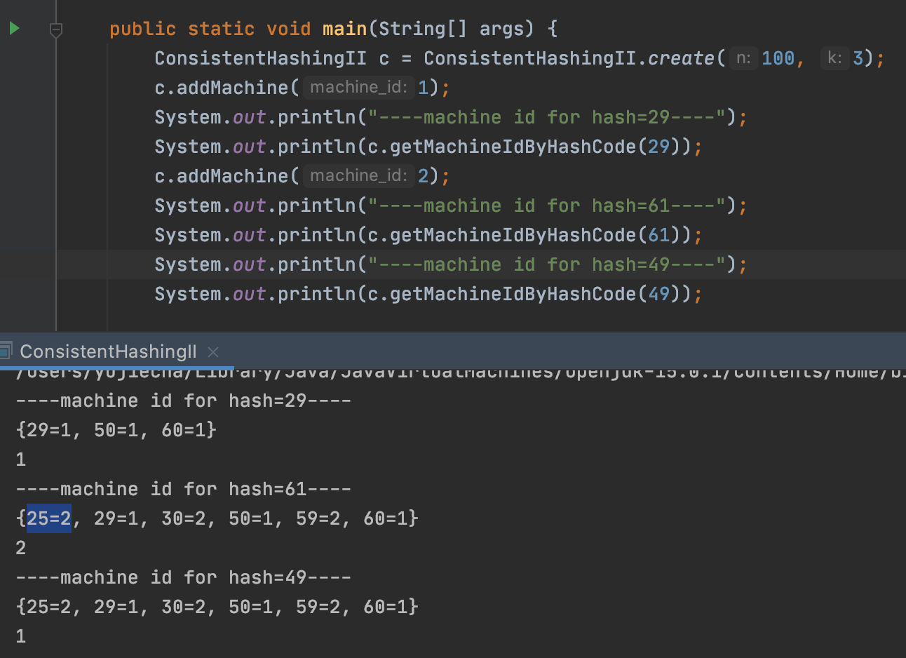

在简单的一致性哈希算法 有两个缺陷:    
增加一台机器之后，数据全部从其中一台机器过来，这一台机器的读负载过大，对正常的服务会造成影响。  
当增加到3台机器的时候，每台服务器的负载量不均衡，为1:1:2。  

一个更好的算法是这样:  
将 360° 的区间分得更细, 从[0，359], 变为一个[0, n - 1]的区间，将这个区间首尾相接，连成一个圆。  
当加入一台新的机器的时候，随机选择在圆周中撒k个点，代表这台机器的k个micro-shards/virtual nodes  

每个数据在圆周上也对应一个点，这个点通过一个hashfunction来计算。 
一个数据该属于哪台机器负责管理，是按照该数据对应的圆周上的点在圆上顺时针碰到的第一个virtual node点所属的机器来定的。  

真实的NoSQL数据库中一般是`n = 2^64, k= 1000`   


create(int n, int k)
addMachine(int machine_id) // add a new machine, return a list of shard ids.
getMachineIdByHashCode(int hashcode) // return machine id

输入:
  create(100, 3)
  addMachine(1)
  getMachineIdByHashCode(4)
  addMachine(2)
  getMachineIdByHashCode(61)
  getMachineIdByHashCode(91)
输出: 
  [77,83,86]
  1
  [15,35,93]
  1
  2


Key Ideas:
- 加入新机器时，分摊每个机器的数据迁移的压力，而不是极个别机器承受大量迁移，余下机器不参与
- 在分派数据时，让数据更均匀的分布在所有机器上，已达到达到负载均衡
- 数据和机器都被映射到同一个hash ring的空间上，某种程度上被同质化了，因此它们的关系可以更好被分配和对应

Notes:
- a machine has multiple shardIds
- a shardId can only be mapped to a machine
- TreeMap gurantees the ordering of entry based on key `shardId`

Takes:
- `getMachineIdByHashCode(int hashcode)` is the function that decides 
    - which machine to distribute data to
    - which machine to fetch the data from
- algorithm: find nearest virtual node clock-wisely, then map back to the node's actual machine

- Usage Pseudocode:

# dispatch data to the machine
int hashcode = hash(user_id);
int machineId = getMachineIdByHashCode(hashcode);
Node machine = getMachine(machineId);
machine.insert(user_id, some_data);

# fetch data from the machine  
int hashcode = hash(user_id);
int machineId = getMachineIdByHashCode(hashcode);
Node machine = getMachine(machineId);
Data data = machine.get(user_id);



public class ConsistentHashingII {
    private int n; // the n sections on the ring labeled as 0 to (n-1), n = 2^64;
    private int k; // the count of virtual nodes/shards given a machine, k = 1000;
    private Random rand;
    private TreeMap<Integer, Integer> map;  // shardId -> the actual machineId

    public ConsistentHashingII(int n, int k) {
        this.n = n;
        this.k = k;
        this.map = new TreeMap<>();
        this.rand = new Random();
    }

    public static ConsistentHashingII create(int n, int k) {
        return new ConsistentHashingII(n, k);
    }

    public List<Integer> addMachine(int machine_id) {
        List<Integer> res = new ArrayList<>();
        int i = 0;
        while (true) {
            int shardId = rand.nextInt(n); // n defines the amount of sections in hash ring
            if (!map.containsKey(shardId)) {
                map.put(shardId, machine_id); // a valid virtual node generated
                res.add(shardId);
                i++;
            }
            if (i == k) break; // k virtual nodes created
        }
        return res;
    }

    public int getMachineIdByHashCode(int hashcode) {
        // may use hashcode %= n; to ensure hashcode normalized to range [0, n-1]
        if (map.isEmpty()) {
            throw new IllegalStateException("No machine added yet.");
        }
        Map.Entry<Integer, Integer> nearest = map.ceilingEntry(hashcode); // the entry whose key is the smallest larger(or equal) than input key(hashcode)
        return nearest != null ? nearest.getValue() : map.firstEntry().getValue(); // the least key's value
    }
}


if cannot find the ceiling entry whose key larger than the given hash,   
we return machineId whose key/shardId is mininum in TreeMap.  

hash = 61, max key = 60, ceiling entry is null  
so return machineId = 2, whose key = 25 is lowest in TreeMap.  
